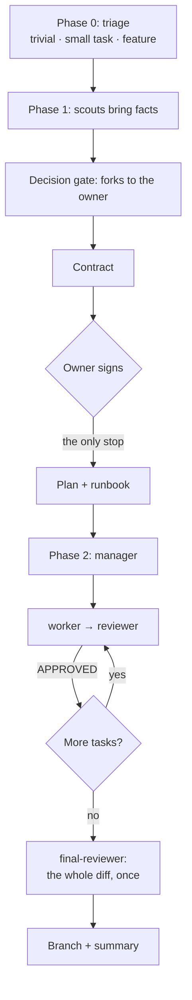

# babysit

**A spec-to-branch pipeline for Claude Code: you sign one contract, you get a reviewed branch.**

A planning head writes a behaviour contract and a task plan. An autonomous manager then runs every task through a worker and a clean-context reviewer until the contract rubric and the deterministic gates pass, and a final reviewer reads the whole diff once at the end. You stop the pipeline exactly once, to sign the contract.

The principle that holds it together: **subagents get eyes and hands, never the head.** Facts come from the scout, code from the worker, verdicts from the reviewer against a written criterion. Decisions are made once, by the head, in the contract.



## Quick start

```bash
# 1. make the plugin available in a session, from your project root
claude --plugin-dir /path/to/babysit-plugin

# 2. in that session, create the project profile once
#    template: skills/feature/references/project-profile-template.md
#    it goes to .claude/babysit.md in your project root

# 3. start a feature
/babysit:feature add filters to the mentor catalogue
```

Phase 1 ends with a contract and a question. Answer it, and the run goes to the end on its own.

## Install as a plugin

This repository is its own marketplace: `.claude-plugin/marketplace.json` sits next to `.claude-plugin/plugin.json`. Publish the repository, put its slug into the `repo` field of the marketplace manifest, then:

```bash
/plugin marketplace add buluktaev/babysit
/plugin install babysit@babysit
```

For a team, pre-register it in the project's `.claude/settings.json` so nobody installs anything by hand:

```json
{
  "extraKnownMarketplaces": {
    "babysit": { "source": { "source": "github", "repo": "buluktaev/babysit" } }
  },
  "enabledPlugins": { "babysit@babysit": true }
}
```

Updates come with `/plugin marketplace update babysit`. There is no version field to bump: for a git source Claude Code uses the commit SHA as the version, so every push is an update.

## Requirements

- Claude Code with plugin support and nested subagents (the manager self-tests this before touching git).
- A project profile at `.claude/babysit.md` — the skill refuses to run without one.
- A `CLAUDE.md` in each repository. Review quality is bounded by it; see Honest limits.

## What is in the box

| Component | Model | Role |
|---|---|---|
| `/babysit:feature` skill | the session's model | Phase 1: triage, reconnaissance, contract, plan, runbook, one sign-off stop. Phase 2: dispatches the manager, handles escalations |
| `babysit:manager` | Opus | Executes the ready plan task by task. Never writes code |
| `babysit:worker` | Opus | One task at a time: test from the plan's assertions, implementation by pointer, gate, commit, report |
| `babysit:reviewer` | Opus, read-only | Clean context. Checks the diff against the contract and the repo's conventions, runs the gates itself, returns `VERDICT:` |
| `babysit:final-reviewer` | the most capable | One pass on the whole diff after the last task. The only reviewer allowed to treat the contract as the subject, not the standard |
| `babysit:scout` | Sonnet | Read-only facts with coordinates. Forbidden to choose or suggest |
| `babysit:design-scout` | Sonnet | Proves every design node resolves, then describes states and texts in words. Never infers behaviour from a picture |

## Three lanes, not one

Triage runs before anything else and stops at the first lane that holds. A pipeline that puts a contract behind a one-line change gets abandoned within weeks.

| Lane | When | What you get |
|---|---|---|
| **Trivial** | One repo, every touched file nameable from the request alone | The change, done directly. No kit, no manager |
| **Small task** | File list knowable after at most one scout, no new screen states | One `task.md`, 2–4 tasks, same worker → reviewer loop |
| **Feature** | Several repositories, a design source, schema change, or the file list needs reconnaissance | The full kit and the final whole-diff review |

Triage cuts paperwork volume, never a gate. The lane may change mid-flight, and saying so out loud is part of the job.

## What lands on disk

- **The feature kit** — contract, plan, runbook, README — where your profile says.
- **Per-task reports** from every worker and reviewer, including one file per revision round.
- **The final review** — findings above the bar, what was checked and cleared, and what fell below it.
- **A run log** — one line per finished task with the *cause* of any extra round. The payload is the cause column: "T5 took two rounds" teaches nobody anything, "the plan's mock shape did not match the real spec" is a template fix.
- **An incident log** — one line per process slip. Two open entries of one class mean the skill or an agent gets fixed, not the case.

## Configuration

Everything project-specific lives in `.claude/babysit.md`. The plugin holds mechanics only, so an agent is never wrong in one project because it was right in another.

| Section | What it decides |
|---|---|
| Repositories | Paths, base branches, gate commands, single-run test command. Row order = phase order |
| Layout | Where kits, the features index, the side-findings register and both logs live |
| Durable knowledge | Interview skill for the decision gate, glossary, decision journal and its shape |
| Tracker | Kind, CLI, projects, verbs. A journal, never the carrier of the contract |
| Policies | Branch prefix, worktrees, commit trailers, changelog, final review on or off, the dev stand never to kill |
| Terminology | Names that differ between code and storage, and where the canonical mapping lives |

Stack conventions — validation rules, layer boundaries, naming — are **not** profile material. They belong in each repository's `CLAUDE.md`, which every subagent receives automatically.

## Honest limits

- **Review quality equals the quality of your `CLAUDE.md`.** The reviewer checks the diff against the plan's Global Constraints and whatever rules the repository states. A thin `CLAUDE.md` gets a reviewer that can only check the contract and the gates.
- **Token cost.** A multi-agent run costs several times a single long session; Anthropic's own figure for their research system is about 15× a chat. The final whole-diff review alone starts around 65k tokens before it reads anything. Worth it on work that spans sessions, files or repositories. Not on a one-line fix — that is what lane 1 is for.
- **Writes are strictly sequential.** One worker, one branch, no parallel edits. Deliberate: parallel writers make conflicting implicit decisions. Scouts may run in parallel.
- **The contract is signed by a human.** The reviewer catches violations of the contract; it cannot catch a wrong contract. The sign-off stop is the only thing that does, and it is not removable.
- **No resume of a running subagent** in current builds. Escalation means the manager finishes with a dump; you relaunch it with a decision and "Continue from T<N>". The mechanics are built around this.
- **The worker has no tool restriction in its frontmatter**, so project tools such as design MCP servers stay reachable. Its prohibitions are by instruction, which is weaker than a tool list. The reviewer and both scouts are tool-restricted.
- **Nested agent naming.** Plugin agents are registered under namespaced types only — `babysit:manager`, `babysit:worker`, and so on. A bare name is refused with `Agent type 'scout' not found`. Verified 2026-09-09 on Claude Code 2.1.265 by running the manager's step-0 self-test headlessly, three levels deep. The self-test stays in the manager because builds change, and the skill has a manual-launch fallback for when it fails.

## First production run

One feature, two repositories, 2026-09-14. Twelve planned tasks plus two fix tasks raised by the final review. Twelve approved on the first round, two on the second, no escalations, gates green throughout.

What it proved and what it cost:

- The final whole-diff review returned two findings at P2, both breaking the contract, both invisible to per-task review by construction. One was a defect in the plan itself.
- The rule that an assertion must fail on a broken implementation caught seven non-discriminating scenarios written by a planning session that did not use this plugin's template.
- Two defects in this plugin surfaced and are fixed: a worker could edit a component another task owned without pinning the change with an assertion, and a revision round could end with a dirty working copy while the report claimed otherwise.

## Versioning

`plugin.json` deliberately has **no `version` field**. Claude Code treats the version as the cache key: with a fixed version string, new commits never reach installed copies and `/plugin update` reports "already at the latest version". Without it, the git commit SHA is the version and every push is an update — right for a plugin under active development. Add a version only when you start cutting releases, and then bump it on every one.

## Layout

```
babysit-plugin/
├── .claude-plugin/plugin.json
├── agents/
│   ├── manager.md
│   ├── worker.md
│   ├── reviewer.md
│   ├── final-reviewer.md
│   ├── scout.md
│   └── design-scout.md
├── skills/feature/
│   ├── SKILL.md
│   └── references/
│       ├── project-profile-template.md
│       ├── contract-template.md
│       ├── implementation-plan-template.md
│       ├── agent-runbook-template.md
│       ├── feature-readme-template.md
│       └── worker-readiness-checklist.md
└── README.md
```

## Lineage

Extracted from the babysit pipeline used on the Menty project (Selecty), after a survey of comparable setups: the `fable-ruki-agenty` skill, LogRocket's agent harness, Dotzlaw's multi-agent pipelines, Cognition's and Anthropic's essays on multi-agent failure modes, and the spec-driven-development tools (Spec Kit, Kiro, OpenSpec). The mechanics were already at par; the extraction made the project seam explicit.

## License

MIT — see [LICENSE](LICENSE).

---

Русская версия — [README.ru.md](README.ru.md).
