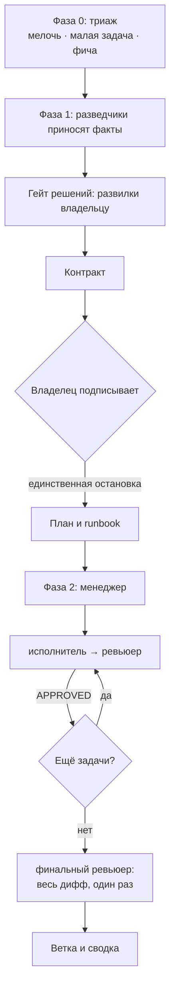

# babysit

**Конвейер «от контракта до ветки» для Claude Code: вы подписываете один документ и получаете ветку с отревьюенными коммитами.**

Планирующая голова пишет контракт поведения и план задач. Дальше автономный менеджер прогоняет каждую задачу через исполнителя и ревьюера с чистым контекстом, пока не сойдутся рубрика контракта и детерминированные гейты, а в конце финальный ревьюер один раз читает весь дифф целиком. Конвейер останавливается ровно один раз — чтобы вы подписали контракт.

Принцип, на котором всё держится: **субагентам достаются глаза и руки, но не голова.** Факты приносит разведчик, код пишет исполнитель, вердикт выносит ревьюер по написанному критерию. Решения принимаются один раз, головой, в контракте.



## Быстрый старт

```bash
# 1. подключить плагин в сессии, из корня проекта
claude --plugin-dir /путь/к/babysit-plugin

# 2. в этой сессии один раз создать профиль проекта
#    шаблон: skills/feature/references/project-profile-template.md
#    класть в .claude/babysit.md в корне проекта

# 3. запустить фичу
/babysit:feature добавить фильтры в каталог менторов
```

Фаза 1 заканчивается контрактом и вопросом. Ответьте на него, и прогон дойдёт до конца сам.

## Установка как плагина

Репозиторий сам себе маркетплейс: `.claude-plugin/marketplace.json` лежит рядом с `.claude-plugin/plugin.json`. Опубликуйте репозиторий, подставьте его слаг в поле `repo` манифеста маркетплейса, дальше:

```bash
/plugin marketplace add buluktaev/babysit
/plugin install babysit@babysit
```

Команде — предустановка в `.claude/settings.json` проекта, чтобы никто ничего не ставил руками:

```json
{
  "extraKnownMarketplaces": {
    "babysit": { "source": { "source": "github", "repo": "buluktaev/babysit" } }
  },
  "enabledPlugins": { "babysit@babysit": true }
}
```

Обновления — `/plugin marketplace update babysit`. Поле версии поднимать не нужно: для git-источника Claude Code берёт версией SHA коммита, поэтому обновлением считается каждый push.

## Что нужно

- Claude Code с поддержкой плагинов и вложенных субагентов (менеджер проверяет это самотестом до первого действия с git).
- Профиль проекта в `.claude/babysit.md` — без него скилл не запускается.
- `CLAUDE.md` в каждом репозитории. Качество ревью ограничено им, см. «Честные ограничения».

## Что внутри

| Компонент | Модель | Роль |
|---|---|---|
| Скилл `/babysit:feature` | модель сессии | Фаза 1: триаж, разведка, контракт, план, runbook, одна остановка на подпись. Фаза 2: запуск менеджера, разбор эскалаций |
| `babysit:manager` | Opus | Исполняет готовый план по задачам. Код не пишет никогда |
| `babysit:worker` | Opus | По одной задаче: тест из ассертов плана, реализация по указателю, гейт, коммит, отчёт |
| `babysit:reviewer` | Opus, только чтение | Чистый контекст. Сверяет дифф с контрактом и конвенциями репозитория, сам гоняет гейты, отвечает строкой `VERDICT:` |
| `babysit:final-reviewer` | самая способная | Один проход по всему диффу после последней задачи. Единственный ревьюер, которому разрешено считать контракт предметом разбора, а не эталоном |
| `babysit:scout` | Sonnet | Факты с координатами, только чтение. Выбирать и предлагать запрещено |
| `babysit:design-scout` | Sonnet | Доказывает, что каждая нода макета открывается, и описывает состояния и тексты словами. Поведение из картинки не выводит |

## Три дорожки, а не одна

Триаж идёт раньше всего и останавливается на первой подошедшей дорожке. Конвейер, который ставит контракт перед правкой в одну строку, забрасывают через пару недель.

| Дорожка | Когда | Что получаете |
|---|---|---|
| **Мелочь** | Один репозиторий, все затронутые файлы называются из самой просьбы | Правку, сделанную напрямую. Без комплекта и менеджера |
| **Малая задача** | Список файлов известен после одного разведчика, новых экранных состояний нет | Один `task.md`, 2–4 задачи, тот же цикл исполнитель → ревьюер |
| **Фича** | Несколько репозиториев, макеты, изменение схемы или список файлов нужно разведывать | Полный комплект и финальное ревью всего диффа |

Триаж режет объём бумаг, но никогда не гейт. Дорожка может поменяться по ходу, и сказать об этом вслух — часть работы.

## Что остаётся на диске

- **Комплект фичи** — контракт, план, runbook, README — там, где указано в профиле.
- **Отчёты по каждой задаче** от исполнителя и ревьюера, включая отдельный файл на каждый круг доработки.
- **Финальное ревью** — находки выше планки, список проверенного и снятого, и всё, что ниже планки.
- **Журнал прогонов** — строка на каждую завершённую задачу с *причиной* лишнего круга. Смысл в колонке причины: «T5 заняла два круга» не учит никого, «форма мока в плане не совпала с реальной спекой» — это правка шаблона.
- **Журнал сбоев** — строка на каждую осечку процесса. Две открытые записи одного класса означают, что чинится скилл или агент, а не случай.

## Настройка

Всё проектное живёт в `.claude/babysit.md`. Плагин держит только механику, поэтому агент никогда не оказывается неправ в одном проекте из-за того, что был прав в другом.

| Раздел | Что определяет |
|---|---|
| Репозитории | Пути, базовые ветки, команды гейтов, команда однократного прогона тестов. Порядок строк = порядок фаз |
| Раскладка | Где лежат комплекты, оглавление фич, реестр попутных находок и оба журнала |
| Долгоживущее знание | Скилл интервью для гейта решений, глоссарий, журнал решений и его форма |
| Трекер | Вид, CLI, проекты, глаголы. Журнал, но никогда не носитель контракта |
| Политики | Префикс веток, worktree, трейлеры коммитов, changelog, финальное ревью, стенд, который нельзя убивать |
| Терминология | Имена, различающиеся между кодом и хранилищем, и где лежит канонический маппинг |

Конвенции стека — правила валидации, границы слоёв, именование — в профиль **не** идут. Их место в `CLAUDE.md` каждого репозитория, который субагенты получают автоматически.

## Честные ограничения

- **Качество ревью равно качеству вашего `CLAUDE.md`.** Ревьюер сверяет дифф с Global Constraints плана и с теми правилами, которые записаны в репозитории. Тонкий `CLAUDE.md` даёт ревьюера, умеющего проверить только контракт и гейты.
- **Стоимость в токенах.** Многоагентный прогон стоит в несколько раз дороже одной длинной сессии; у Anthropic для их исследовательской системы названа цифра около пятнадцатикратной. Одно финальное ревью начинается примерно с 65 тысяч токенов ещё до первой прочитанной строки. Оправдано на работе, которая не влезает в одну сессию, файл или репозиторий. Не оправдано на правке в одну строку — для этого есть первая дорожка.
- **Записи строго последовательны.** Один исполнитель, одна ветка, никаких параллельных правок. Это осознанно: параллельные писатели принимают противоречащие друг другу неявные решения. Разведчики могут работать параллельно.
- **Контракт подписывает человек.** Ревьюер ловит нарушения контракта, но не может поймать неверный контракт. Это умеет только остановка на подпись, и убрать её нельзя.
- **Работающего субагента нельзя продолжить** в нынешних сборках. Эскалация означает, что менеджер завершается с дампом, а вы перезапускаете его с решением и строкой «Продолжай с T<N>». Механика построена вокруг этого.
- **У исполнителя не ограничен список инструментов** во frontmatter, чтобы оставались доступны проектные инструменты вроде дизайнерских MCP-серверов. Его запреты держатся на инструкции, а это слабее списка инструментов. У ревьюера и обоих разведчиков инструменты ограничены.
- **Имена вложенных агентов.** Агенты плагина зарегистрированы только с префиксом — `babysit:manager`, `babysit:worker` и так далее. Голое имя отвергается ошибкой `Agent type 'scout' not found`. Проверено 2026-09-09 на Claude Code 2.1.265 запуском самотеста менеджера в headless-режиме на три уровня вложенности. Самотест остаётся в менеджере, потому что сборки меняются, а у скилла есть запасной путь с ручным запуском.

## Первый боевой прогон

Одна фича, два репозитория, 14 сентября 2026 года. Двенадцать задач плана плюс две задачи-исправления, поднятые финальным ревью. Двенадцать приняты с первого круга, две со второго, эскалаций нет, гейты зелёные на всём протяжении.

Что он доказал и во что обошёлся:

- Финальное ревью всего диффа вернуло две находки уровня P2, обе ломали контракт, обе невидимы для поштучной приёмки по её устройству. Одна была дефектом самого плана.
- Правило «ассерт обязан падать на сломанной реализации» поймало семь неразличающих сценариев, написанных планирующей сессией, которая работала не по шаблону этого плагина.
- Вскрылись и исправлены два дефекта самого плагина: исполнитель мог править компонент, принадлежащий другой задаче, не закрепив правку ассертом, и круг доработки мог завершиться с грязной рабочей копией, о чём отчёт умалчивал.

## Версионирование

В `plugin.json` намеренно **нет поля `version`**. Claude Code использует версию как ключ кэша: при фиксированной строке новые коммиты не доезжают до установленных копий, а `/plugin update` отвечает «уже последняя версия». Без неё версией становится SHA коммита, и каждый push — это обновление, что правильно для плагина в активной разработке. Поле стоит добавить, только когда начнёте резать релизы, и тогда поднимать его на каждом.

## Раскладка

```
babysit-plugin/
├── .claude-plugin/plugin.json
├── agents/
│   ├── manager.md
│   ├── worker.md
│   ├── reviewer.md
│   ├── final-reviewer.md
│   ├── scout.md
│   └── design-scout.md
├── skills/feature/
│   ├── SKILL.md
│   └── references/
│       ├── project-profile-template.md
│       ├── contract-template.md
│       ├── implementation-plan-template.md
│       ├── agent-runbook-template.md
│       ├── feature-readme-template.md
│       └── worker-readiness-checklist.md
└── README.md
```

## Происхождение

Вынесено из babysit-конвейера проекта Menty (Selecty) после разбора сопоставимых решений: скилла `fable-ruki-agenty`, агентной обвязки LogRocket, многоагентных конвейеров Dotzlaw, эссе Cognition и Anthropic про режимы отказа многоагентных систем и инструментов спек-ориентированной разработки (Spec Kit, Kiro, OpenSpec). Механика и так была на уровне; вынесение сделало явным шов между плагином и проектом.

## Лицензия

MIT — см. [LICENSE](LICENSE).

---

English version — [README.md](README.md).
